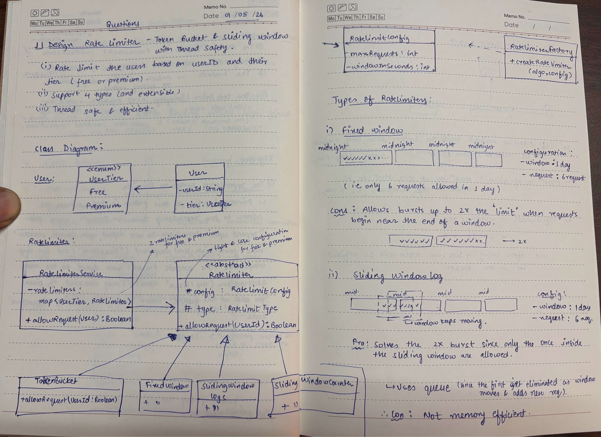
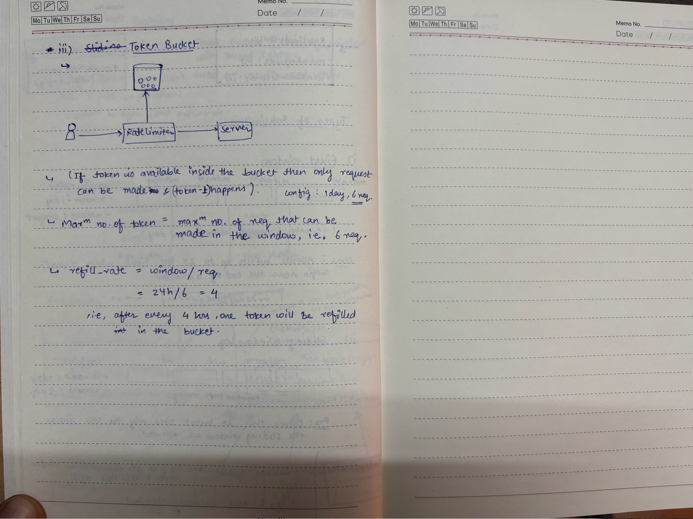

## 📝 Handwritten Notes

### Overview

# Rate Limiter (Low-Level Design)

This project implements a **rate limiting system** using multiple algorithms and clean LLD principles.

## 🚀 Features
- Supports multiple rate limiting strategies:
  - Token Bucket
  - Fixed Window
- Configurable limits per user tier (FREE, PREMIUM)
- Factory Pattern to create appropriate rate limiter
- Strategy Pattern to switch between algorithms easily

## 🧠 Design Overview
- `RateLimiter` (abstract class) defines the contract
- Concrete implementations:
  - `TokenBucketRateLimiter`
  - `FixedWindowRateLimiter`
- `RateLimiterFactory` handles object creation
- `RateLimiterService` routes requests based on user tier

## ⚙️ How it works
Each user request is validated against a configured rate limit.  
The system selects the appropriate algorithm based on user tier and checks whether the request should be allowed or blocked.

## 📌 Concepts Used
- Low-Level Design (LLD)
- Strategy Pattern
- Factory Pattern
- Thread-safe data structures
